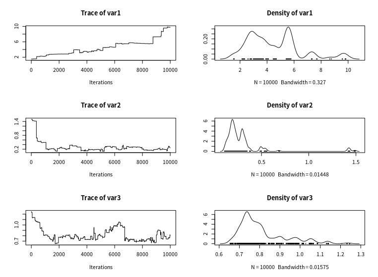
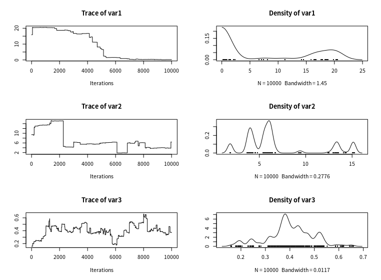
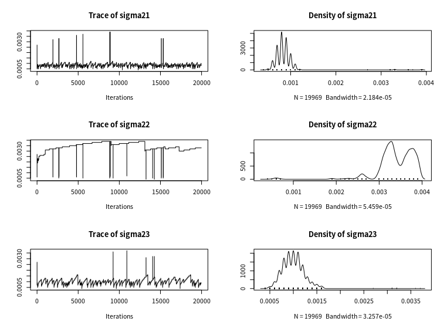

# Fix k moves

- 预测10000步，结果如下

其中红色是真实值，蓝色是预测值，阴影是95%置信区间。
- 对比用真实参数预测的结果

其中红色是真实值，蓝色是预测值，阴影是95%置信区间。

-参数的收敛过程

w= [10.0  0.5  1.0]

v=[0.2 1.0 0.2]

sigma2=[ 0.0005 0.0010 0.0025]

10000次迭代参数似乎还未收敛，而且与真实值有一定差距。
- z:

2  2  2  2  1  2  0  0  0

类别数目不正确。考虑用原来的数据做。

- rmse:
0.0356111

- 每一类的rmse=[0.0206 0.0144 0.0563]

- 每一类的相关性=[ 0.9980 0.9997 0.9951]

-对比原来的方法：

EM算法

fix MC和变化的MC

rmse全部变小

- log likelihood

改正了nuts中U和K的符号之后，迭代过程中似然一直没有变化。

- 收敛性分析

w1=10

w2=0.5

w3=1.0

v1=0.2

v2=1.0

v3=0.2

s1=0.0005

s2=0.001

s3=0.0025

由于Rhat越接近1说明越收敛，从Rhat可以看出，参数还未收敛。
