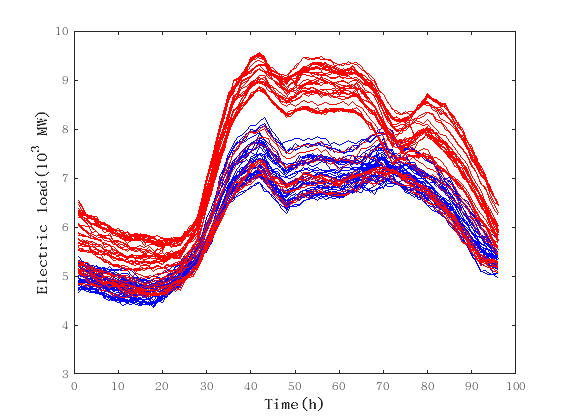

# electric load 2008
## RJMCMC
- RMSE
100天数据训练
预测两周的数据
不断把新的点加入

RMSE   0.0189967+-0.08865918

- 时间 6.90 h
- clustering

## nuts depth=2

- RMSE: 13.79001+- 3.217013
- time:11.97min

## nuts depth=8
- RMSE: 1.630245+- 0.33197
- time:25.8min
- RMSE:0.1262911+- 2.0537
- time:94.15min
- time :145.23min

# MGP EM fix k BIC
- RMSE0.0189+-0.0080
- 时间7.3min
- 模型选择的正确率100%
- clustering

