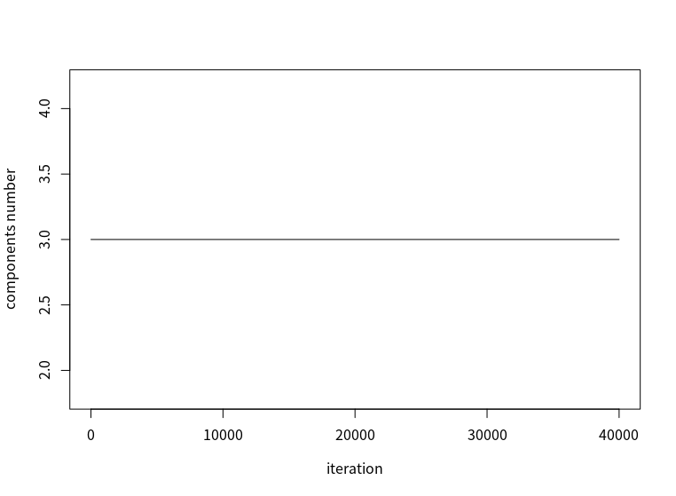
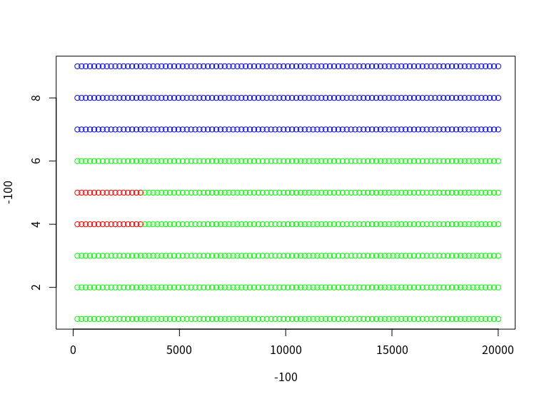

# fix k moves
没有对参数进行排序

- 预测20000步，结果如下

对数似然的变化

2000次并没有让对数似然平稳，所以继续迭代到40000步
分量数目的变化

- z:

类别不正确正确

- rmse:
0.0505

- 每一类的rmse

 0.0614 0.0252 0.0649

-对比原来的方法：

EM算法

fix MC和变化的MC

只有第三类的rmse大
