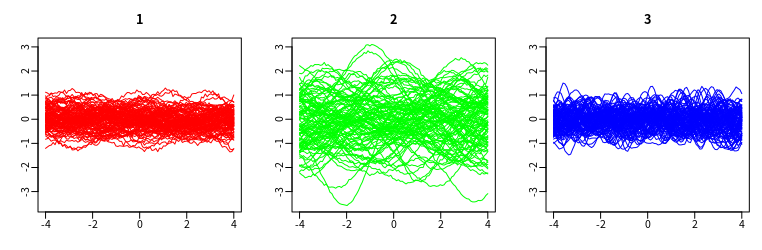

# Large num

- 种子
113584957
487306701
812614905
- 3类，每一类50条曲线，

参数如下
 w 1 0.5 10
 v 0.2 1 0.2
 sigma2 0.0025 0.001 0.0005

- 参数收敛的指标

迭代160000步
Rhat
pi 1 1 1
w 1.05  1.01   1.03
v 1.04  1.01  1.03
sigma2 1.06  1.05  1.02

time 24h
