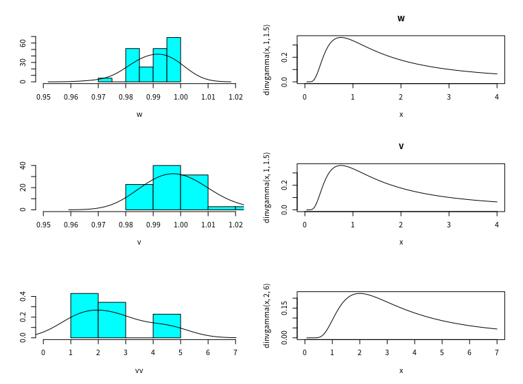
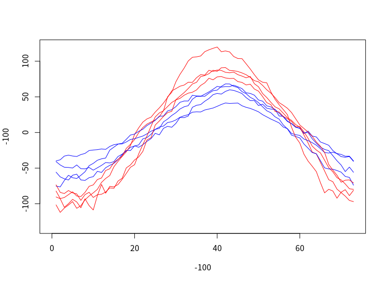
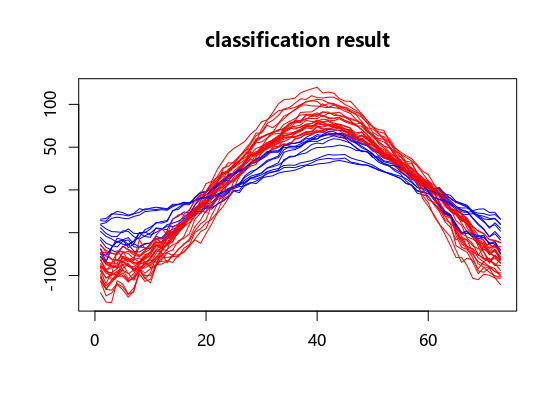

# varied k moves
没有对参数进行排序

每一类选择2条曲线，共8条曲线。
每条曲线减去自身的均值。

- 先验采用平坦先验

- 20000步
分类的结果如下：

聚类的结果

但聚类的结果和专家统计结果不同
专家给的分类结果

专家分类结果
 [1] 1 1 1 1 1 1 1 1 1 1 1 1 1 1 1 2 2 2 2 2 2 2 2 2 3 3 3 3 3 2 2 2 4 4 4

 程序结果如下
 [1] 2 2 2 2 2 1 1 1 1 1 1 1 1 1 1 1 1 1 1 1 1 1 1 2 2 2 2 2 2 1 1 1 1 1 1

其中把第1类和第3类划分为2类，把2类和4类划分为1类。第二类有几条曲线分类结果不一致。在图中用红色的点表示。
第一二三四类依次是 "red","blue","yellow","green"
红色的点表示f分类结果不一致的点。

在程序分类的结果中，红色表示弯曲度较大的一类，而蓝色表示弯曲度小的一类。
而专家分类结果中，绿色和蓝色的曲线整体弯曲较大，而红色和黄色整体弯曲度较小，因而对应关系正确。
对于分错的线，形状更加接近蓝色和绿色，因此我们的分类结果更加可靠。
- 考虑在RJMCMC中加入简单的均值。
